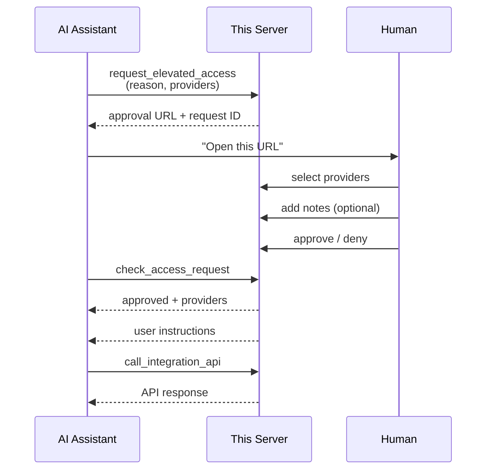

# Pipes MCP Template

A starter template for building an MCP server with human-approved, provider-scoped access to third-party APIs using [WorkOS Pipes](https://workos.com/docs/pipes). It shows one way to let AI assistants securely interact with services like Linear, Notion, Snowflake, and more with a human in the loop, without trying to prescribe the full deployment story or how approval requests should be delivered.

## What's included

- **Human-in-the-loop approval flow** — AI assistants request access, humans approve via a browser-based consent screen
- **Provider-scoped authority** — humans select exactly which integrations to authorize (not all-or-nothing)
- **Unified authority grants** — broad and per-request approvals share one `AuthorityGrant` model
- **Time-limited sessions** — authority expires after 5 minutes, configurable
- **Read/write gating** — read and write operations are gated separately
- **Approval polling** — assistants poll for results and receive user instructions

## The approval flow



Broad authority and per-request approval now use the same underlying grant record:

- `kind: "broad"` grants temporary session authority for selected providers
- `kind: "request"` approves one exact API call and is consumed on execution

## Authorization structure

Every MCP request is authenticated first, then authorized from the current Pipes session and grant state:

1. `app/[transport]/route.ts` requires AuthKit authentication for every MCP request.
2. `lib/mcp/with-authkit.ts` verifies the bearer token, loads the WorkOS user, and loads or creates a Redis-backed `PipesSession` keyed by `sid + organizationId`.
3. Effective MCP scopes are derived from the session's current broad authority, not directly from JWT claims.
4. `request_elevated_access` creates pending `AuthorityGrant` records:
   - broad grants request temporary `read` or `write` authority for selected providers
   - request grants store the exact `url`, `method`, and optional `body` for one API call
5. The approval UI resolves that grant:
   - approved broad grants become `session.activeGrant`
   - approved request grants stay in Redis as single-use approved grants
6. `call_integration_api` enforces access by either:
   - checking the active broad grant for read/write level and provider access
   - or consuming a matching approved request grant bound to the same `sid`, `userId`, and `organizationId`

## Quick start

### Prerequisites

- Node.js 20+
- [pnpm](https://pnpm.io/)
- Redis
- A [WorkOS](https://workos.com) account with AuthKit and Pipes configured

### 1. Install dependencies

```bash
pnpm install
```

### 2. Start Redis

Redis is required for session and approval state storage.

```bash
# macOS (Homebrew)
brew install redis
brew services start redis

# Docker
docker run -d -p 6379:6379 redis

# Or run directly
redis-server
```

Verify it's running:

```bash
redis-cli ping
# PONG
```

### 3. Configure environment

```bash
cp .env.local.example .env.local
```

Fill in your values:

```bash
WORKOS_API_KEY=sk_test_...
WORKOS_CLIENT_ID=client_...
WORKOS_COOKIE_PASSWORD=<generate with: openssl rand -base64 32>
WORKOS_REDIRECT_URI=http://localhost:5711/callback
AUTHKIT_DOMAIN=auth.workos.com
REDIS_URL=redis://127.0.0.1:6379
```

Optional tuning:

```bash
SESSION_TTL_MS=604800000          # Session store TTL (default: 7 days)
SESSION_AUTHORITY_TTL_MS=300000   # Authority expiry (default: 5 minutes)
```

### 4. Start the dev server

```bash
pnpm dev
```

The server starts at `http://localhost:5711`.

## Connecting an MCP client

Point your MCP client (Claude Code, Claude Desktop, Cursor, etc.) at the server URL. The server uses Streamable HTTP transport at `http://localhost:5711/mcp`.

## Adding a new provider

1. Add a new provider module in `lib/mcp/providers/` that exports a `ProviderDefinition`
2. Implement `matchesUrl`, `buildHeaders`, and, if needed, `isWriteOperation` for provider-specific write detection
3. Register the provider in `lib/mcp/providers/index.ts`
4. Update `lib/mcp/token-injection.ts` only if the provider needs auth behavior beyond the default Bearer token injection
5. Configure the integration in your WorkOS dashboard

The `call_integration_api` tool auto-detects the provider from the API URL domain and injects the correct authentication headers.

## Redis keys

| Key pattern | Data | TTL |
|-------------|------|-----|
| `pipes:mcp:session:{sid}:{orgId}` | Stored session record with active broad, pending broad, and active request grant IDs | Default 7 days; may be deleted earlier if idle |
| `pipes:mcp:authority-grant:{id}` | Unified broad/request grant record in `pending`, `approved`, or `denied` state | Up to 5 min; preserved as remaining grant lifetime after resolution |
| `pipes:mcp:approval-token:{jti}` | One-time approval-token consumption guard (not the encrypted token itself) | Remaining approval-token lifetime, up to 5 min |

## Development

```bash
pnpm dev          # Start dev server (Turbopack)
pnpm typecheck    # Type check
pnpm lint         # Lint (Biome)
pnpm format       # Format (Biome)
```

## Contributing

See [CONTRIBUTING.md](CONTRIBUTING.md) for guidelines on how to contribute to this project.

## License

MIT License. See [LICENSE](LICENSE) for details.
